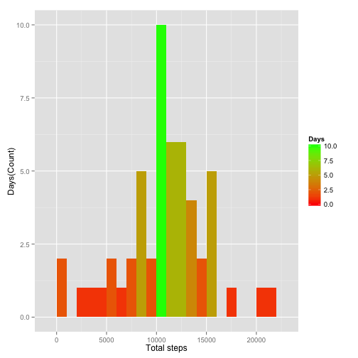
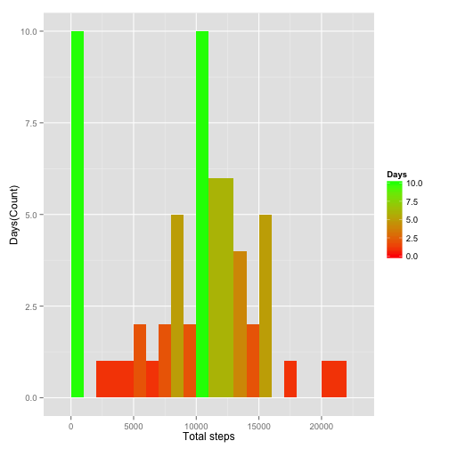
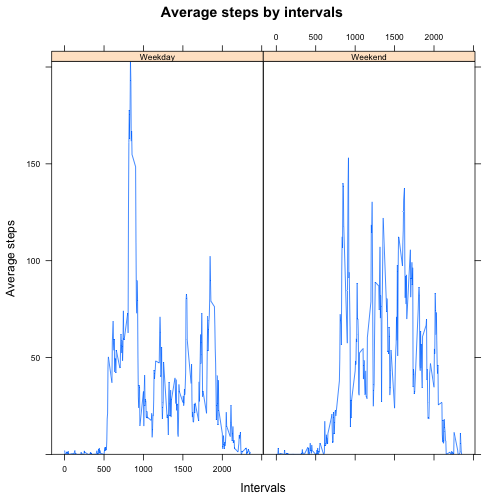

# Reproducible Research: Peer Assessment 1
written by Unshar, June 2014


## Loading and preprocessing the data

```r
# Install function for required packages    
packages<-function(x){
  x<-as.character(match.call()[[2]])
  if (!require(x,character.only=TRUE)){
    install.packages(pkgs=x,repos="http://cran.r-project.org")
    require(x,character.only=TRUE)
  }
}
packages(ggplot2)
```

```
## Loading required package: ggplot2
```

```r
packages(scales)
```

```
## Loading required package: scales
```

```r
packages(lattice)
```

```
## Loading required package: lattice
```

```r
#Load data
  dir<-getwd()
  path<-paste(c(dir,"/activity.csv"), collapse='')
  mydata<-read.csv(path, na.string="NA")
```


## What is mean total number of steps taken per day?
*Missing values are being ignored as directed by the assignment instructions.


```r
#Aggregate steps by date and calculate mean and median
StepsTotal <-aggregate(steps ~ date, data = mydata, sum, na.rm = T)  
colnames(StepsTotal) <- c("Date", "Total")
  x<-mean(StepsTotal$Total)
  y<-median(StepsTotal$Total)
```
### The mean for the total number of steps for all days is 1.0766 &times; 10<sup>4</sup>.
### The median for the total number of steps for all days is 10765.

#### Mean breakdown by day*

```r
StepsMean <-aggregate(steps ~ date, data = mydata, mean, na.rm = T) 
  colnames(StepsMean) <- c("Date", "Mean")
  StepsMean
```

```
##          Date    Mean
## 1  2012-10-02  0.4375
## 2  2012-10-03 39.4167
## 3  2012-10-04 42.0694
## 4  2012-10-05 46.1597
## 5  2012-10-06 53.5417
## 6  2012-10-07 38.2465
## 7  2012-10-09 44.4826
## 8  2012-10-10 34.3750
## 9  2012-10-11 35.7778
## 10 2012-10-12 60.3542
## 11 2012-10-13 43.1458
## 12 2012-10-14 52.4236
## 13 2012-10-15 35.2049
## 14 2012-10-16 52.3750
## 15 2012-10-17 46.7083
## 16 2012-10-18 34.9167
## 17 2012-10-19 41.0729
## 18 2012-10-20 36.0938
## 19 2012-10-21 30.6285
## 20 2012-10-22 46.7361
## 21 2012-10-23 30.9653
## 22 2012-10-24 29.0104
## 23 2012-10-25  8.6528
## 24 2012-10-26 23.5347
## 25 2012-10-27 35.1354
## 26 2012-10-28 39.7847
## 27 2012-10-29 17.4236
## 28 2012-10-30 34.0938
## 29 2012-10-31 53.5208
## 30 2012-11-02 36.8056
## 31 2012-11-03 36.7049
## 32 2012-11-05 36.2465
## 33 2012-11-06 28.9375
## 34 2012-11-07 44.7326
## 35 2012-11-08 11.1771
## 36 2012-11-11 43.7778
## 37 2012-11-12 37.3785
## 38 2012-11-13 25.4722
## 39 2012-11-15  0.1424
## 40 2012-11-16 18.8924
## 41 2012-11-17 49.7882
## 42 2012-11-18 52.4653
## 43 2012-11-19 30.6979
## 44 2012-11-20 15.5278
## 45 2012-11-21 44.3993
## 46 2012-11-22 70.9271
## 47 2012-11-23 73.5903
## 48 2012-11-24 50.2708
## 49 2012-11-25 41.0903
## 50 2012-11-26 38.7569
## 51 2012-11-27 47.3819
## 52 2012-11-28 35.3576
## 53 2012-11-29 24.4688
```

#### Median breakdown by day*

```r
StepsMedian <-aggregate(steps ~ date, data = mydata, median, na.rm = T)
  colnames(StepsMedian) <- c("Date", "Median")
  StepsMedian
```

```
##          Date Median
## 1  2012-10-02      0
## 2  2012-10-03      0
## 3  2012-10-04      0
## 4  2012-10-05      0
## 5  2012-10-06      0
## 6  2012-10-07      0
## 7  2012-10-09      0
## 8  2012-10-10      0
## 9  2012-10-11      0
## 10 2012-10-12      0
## 11 2012-10-13      0
## 12 2012-10-14      0
## 13 2012-10-15      0
## 14 2012-10-16      0
## 15 2012-10-17      0
## 16 2012-10-18      0
## 17 2012-10-19      0
## 18 2012-10-20      0
## 19 2012-10-21      0
## 20 2012-10-22      0
## 21 2012-10-23      0
## 22 2012-10-24      0
## 23 2012-10-25      0
## 24 2012-10-26      0
## 25 2012-10-27      0
## 26 2012-10-28      0
## 27 2012-10-29      0
## 28 2012-10-30      0
## 29 2012-10-31      0
## 30 2012-11-02      0
## 31 2012-11-03      0
## 32 2012-11-05      0
## 33 2012-11-06      0
## 34 2012-11-07      0
## 35 2012-11-08      0
## 36 2012-11-11      0
## 37 2012-11-12      0
## 38 2012-11-13      0
## 39 2012-11-15      0
## 40 2012-11-16      0
## 41 2012-11-17      0
## 42 2012-11-18      0
## 43 2012-11-19      0
## 44 2012-11-20      0
## 45 2012-11-21      0
## 46 2012-11-22      0
## 47 2012-11-23      0
## 48 2012-11-24      0
## 49 2012-11-25      0
## 50 2012-11-26      0
## 51 2012-11-27      0
## 52 2012-11-28      0
## 53 2012-11-29      0
```

### Histogram*

```r
#Aggregate steps by date
  StepsTotal$names <- as.Date(StepsTotal$Date, format="%Y-%m-%d")

#Histogram total steps bins
  m <- ggplot(StepsTotal, aes(x=Total))
    m + geom_histogram(binwidth = 1000, aes(fill = ..count..)) +
    scale_fill_gradient("Days", low = "red", high = "green")+
    ylab("Days(Count)") + xlab("Total steps")
```

 

## What is the average daily activity pattern?

```r
IntervalsMean <-aggregate(steps ~ interval, data = mydata, mean, na.rm = T)
  with(IntervalsMean, plot(interval,
                         steps, 
                         type = "l",
                         xlab = "Interval",
                         ylab = "Average number of steps"))   
```

 
### Which 5-min interval, on average across all the days in the dataset, contains the maximum number of steps?


```r
n <- length(IntervalsMean$steps)
  y<-sort(IntervalsMean$steps,partial=n-0)[n-0]
    x<-subset(IntervalsMean,IntervalsMean$steps==y)
      result<-x[1,1]
```
###  ANSWER: The 835th interval contains the maximum number of steps (206.1698) on average across all the days in this dataset.


## Imputing missing values

```r
#Number os NAs
  x<-sum( is.na(mydata$steps) )
```
### The total number of missing values in the dataset is: 2304
According to this assignments instructions the strategy for filling in NAs does not need to be sophisticated. Since 63% of the observations are zero (against 24% non-NAs and non-zeros ad 13% NAs), the strategy selected was to replace NAs with the same value as majority of observations.


```r
#Replace NAs with zeros
  mydata$steps[is.na(mydata$steps)] <- 0 

##Aggregate steps by date and calculate mean and median
  StepsTotal <-aggregate(steps ~ date, data = mydata, sum, na.rm = T)  
colnames(StepsTotal) <- c("Date", "Total")
  x<-mean(StepsTotal$Total)
  y<-median(StepsTotal$Total)
```

### Histogram of the total number of steps taken each day

```r
#Histogram total steps bins
  m <- ggplot(StepsTotal, aes(x=Total))
    m + geom_histogram(binwidth = 1000, aes(fill = ..count..)) +
    scale_fill_gradient("Days", low = "red", high = "green")+
    ylab("Days(Count)") + xlab("Total steps")
```

 

#### Updated Mean breakdown by day

```r
StepsMean <-aggregate(steps ~ date, data = mydata, mean, na.rm = T) 
  colnames(StepsMean) <- c("Date", "Mean")
  StepsMean
```

```
##          Date    Mean
## 1  2012-10-01  0.0000
## 2  2012-10-02  0.4375
## 3  2012-10-03 39.4167
## 4  2012-10-04 42.0694
## 5  2012-10-05 46.1597
## 6  2012-10-06 53.5417
## 7  2012-10-07 38.2465
## 8  2012-10-08  0.0000
## 9  2012-10-09 44.4826
## 10 2012-10-10 34.3750
## 11 2012-10-11 35.7778
## 12 2012-10-12 60.3542
## 13 2012-10-13 43.1458
## 14 2012-10-14 52.4236
## 15 2012-10-15 35.2049
## 16 2012-10-16 52.3750
## 17 2012-10-17 46.7083
## 18 2012-10-18 34.9167
## 19 2012-10-19 41.0729
## 20 2012-10-20 36.0938
## 21 2012-10-21 30.6285
## 22 2012-10-22 46.7361
## 23 2012-10-23 30.9653
## 24 2012-10-24 29.0104
## 25 2012-10-25  8.6528
## 26 2012-10-26 23.5347
## 27 2012-10-27 35.1354
## 28 2012-10-28 39.7847
## 29 2012-10-29 17.4236
## 30 2012-10-30 34.0938
## 31 2012-10-31 53.5208
## 32 2012-11-01  0.0000
## 33 2012-11-02 36.8056
## 34 2012-11-03 36.7049
## 35 2012-11-04  0.0000
## 36 2012-11-05 36.2465
## 37 2012-11-06 28.9375
## 38 2012-11-07 44.7326
## 39 2012-11-08 11.1771
## 40 2012-11-09  0.0000
## 41 2012-11-10  0.0000
## 42 2012-11-11 43.7778
## 43 2012-11-12 37.3785
## 44 2012-11-13 25.4722
## 45 2012-11-14  0.0000
## 46 2012-11-15  0.1424
## 47 2012-11-16 18.8924
## 48 2012-11-17 49.7882
## 49 2012-11-18 52.4653
## 50 2012-11-19 30.6979
## 51 2012-11-20 15.5278
## 52 2012-11-21 44.3993
## 53 2012-11-22 70.9271
## 54 2012-11-23 73.5903
## 55 2012-11-24 50.2708
## 56 2012-11-25 41.0903
## 57 2012-11-26 38.7569
## 58 2012-11-27 47.3819
## 59 2012-11-28 35.3576
## 60 2012-11-29 24.4688
## 61 2012-11-30  0.0000
```

#### Updated Median breakdown by day

```r
StepsMedian <-aggregate(steps ~ date, data = mydata, median, na.rm = T)
  colnames(StepsMedian) <- c("Date", "Median")
  StepsMedian
```

```
##          Date Median
## 1  2012-10-01      0
## 2  2012-10-02      0
## 3  2012-10-03      0
## 4  2012-10-04      0
## 5  2012-10-05      0
## 6  2012-10-06      0
## 7  2012-10-07      0
## 8  2012-10-08      0
## 9  2012-10-09      0
## 10 2012-10-10      0
## 11 2012-10-11      0
## 12 2012-10-12      0
## 13 2012-10-13      0
## 14 2012-10-14      0
## 15 2012-10-15      0
## 16 2012-10-16      0
## 17 2012-10-17      0
## 18 2012-10-18      0
## 19 2012-10-19      0
## 20 2012-10-20      0
## 21 2012-10-21      0
## 22 2012-10-22      0
## 23 2012-10-23      0
## 24 2012-10-24      0
## 25 2012-10-25      0
## 26 2012-10-26      0
## 27 2012-10-27      0
## 28 2012-10-28      0
## 29 2012-10-29      0
## 30 2012-10-30      0
## 31 2012-10-31      0
## 32 2012-11-01      0
## 33 2012-11-02      0
## 34 2012-11-03      0
## 35 2012-11-04      0
## 36 2012-11-05      0
## 37 2012-11-06      0
## 38 2012-11-07      0
## 39 2012-11-08      0
## 40 2012-11-09      0
## 41 2012-11-10      0
## 42 2012-11-11      0
## 43 2012-11-12      0
## 44 2012-11-13      0
## 45 2012-11-14      0
## 46 2012-11-15      0
## 47 2012-11-16      0
## 48 2012-11-17      0
## 49 2012-11-18      0
## 50 2012-11-19      0
## 51 2012-11-20      0
## 52 2012-11-21      0
## 53 2012-11-22      0
## 54 2012-11-23      0
## 55 2012-11-24      0
## 56 2012-11-25      0
## 57 2012-11-26      0
## 58 2012-11-27      0
## 59 2012-11-28      0
## 60 2012-11-29      0
## 61 2012-11-30      0
```


## Are there differences in activity patterns between weekdays and weekends?

```r
#Create Weekday field
  mydata$day<-weekdays(as.Date(mydata$date))
  mydata$flagday<- ifelse(mydata$day=="Saturday"|mydata$day=="Sunday", "Weekend","Weekday")

#Aggregate steps by Weekday and Interval
  IntervalsMeanDay <-aggregate(mydata$steps, list(day=mydata$flagday, intervals=mydata$interval), mean, na.rm=TRUE)

#Calculate the total mean of the two different sets (Weekend and Weekdays)
x<-(subset(IntervalsMeanDay,IntervalsMeanDay$day=="Weekend"))
xstepswkd<-mean(x$x)
x<-(subset(IntervalsMeanDay,IntervalsMeanDay$day=="Weekday"))
xstepsweek<-mean(x$x)
    
#plot by weekday
  dayplot<- xyplot(x~intervals |day, data=IntervalsMeanDay, 
                 ylim=range(IntervalsMeanDay$x),
                 main="Average steps by intervals", 
                 ylab="Average steps",  
                 xlab="Intervals", type="l",
                 par.strip.text=list(cex=0.7), 
                 par.settings=list(axis.text=list(cex=0.7)))
  print(dayplot)
```

 

### Comment: Subject appears to move more constanly over weekends, taking an average of 37.6936 steps vs 30.6262 steps during the week.
